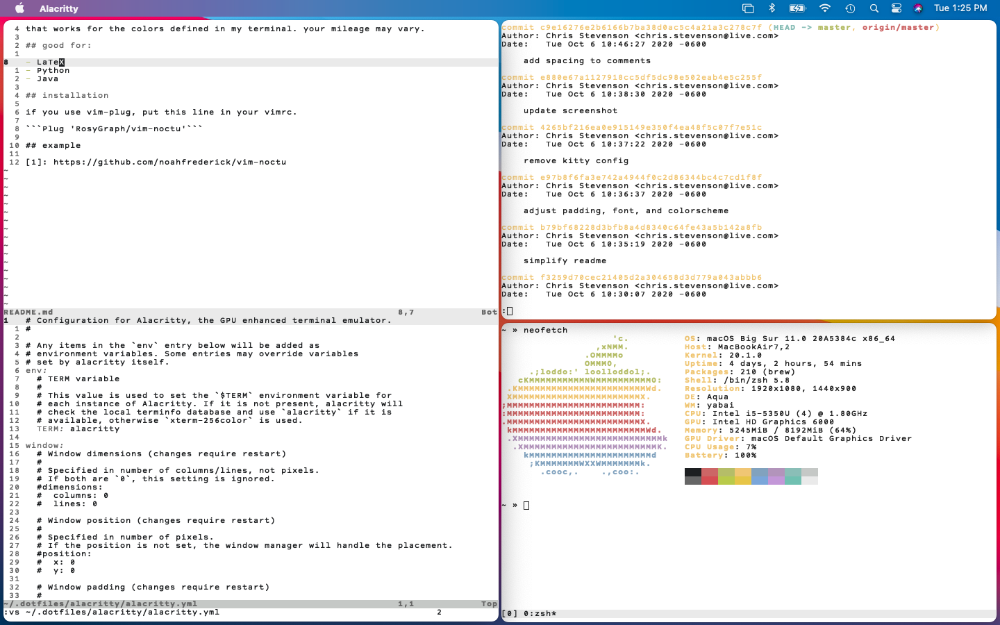

# white paper noctu

a low-color, light Vim color scheme based on [noahfrederick/vim-noctu][1]
that works for the colors defined in my terminal. your mileage may vary.

## good for:

- LaTeX
- Python
- Java

## installation

if you use vim-plug, put this line in your vimrc.

```Plug 'RosyGraph/vim-noctu'```

## example



[1]: https://github.com/noahfrederick/vim-noctu
